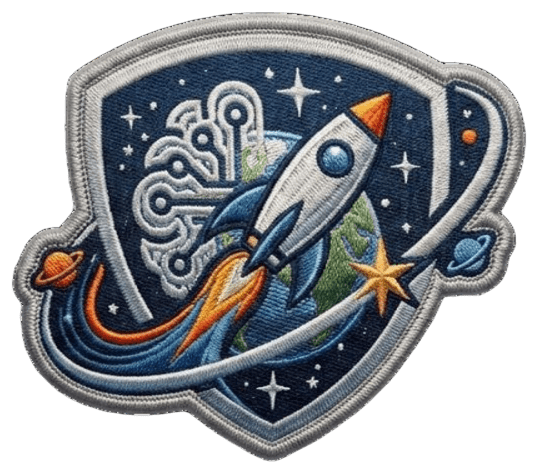
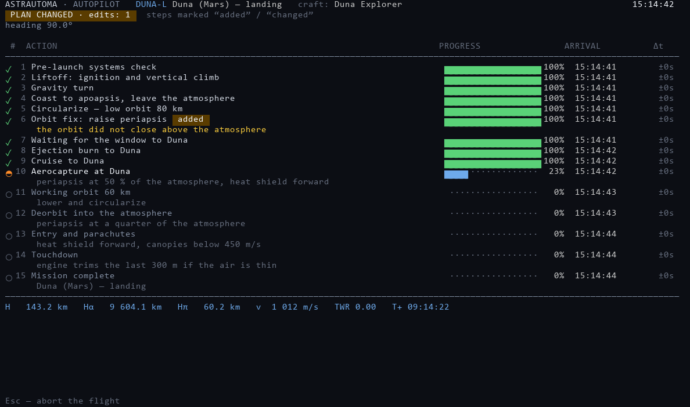
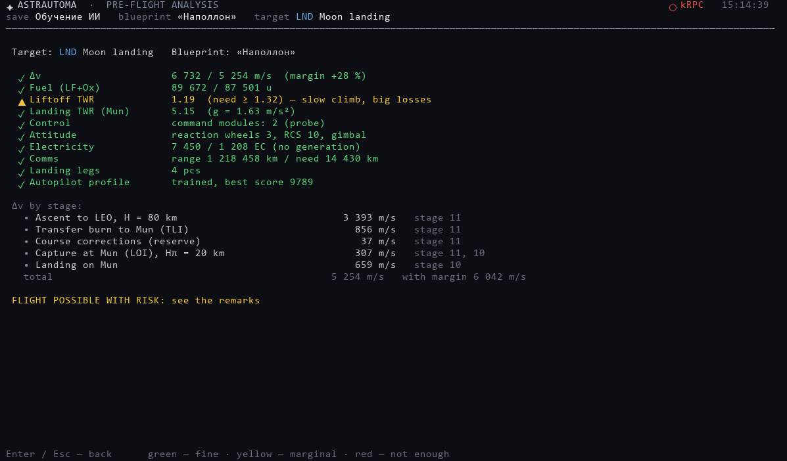
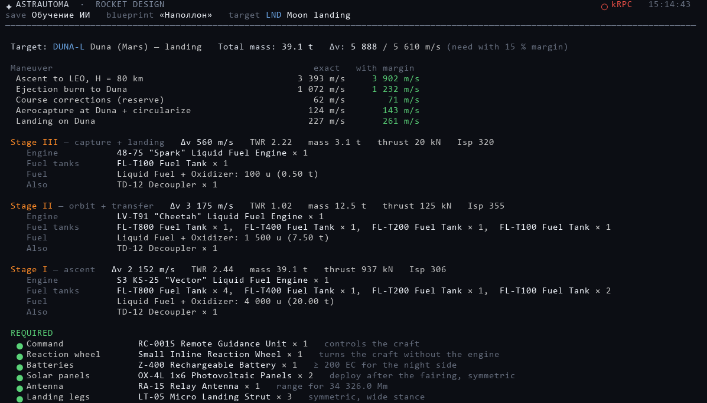

# ASTRAUTOMA

**An autopilot for Kerbal Space Program that plans the flight, checks your rocket and flies it.**

**[🌐 Website](https://himsson.github.io/ASTRAUTOMA/)**

---

ASTRAUTOMA connects to your game through kRPC, reads the rocket on the launch pad and the settings
of your save, and takes it where you tell it: Kerbin orbit, the Mun, or any planet of the system.
It shows its plan before liftoff and then follows it step by step in a live table.

## 🚀 Why ASTRAUTOMA

- **It warns you before launch.** Green, yellow or red for every system: Δv, fuel, TWR,
  control, power, comms, landing legs. No more running out of fuel halfway to the Mun.
- **It plans like a flight engineer.** Launch window, heading that accounts for the planet's rotation,
  and the transfer phase angle from where the Mun and the planets really are right now.
- **It keeps to a schedule.** Every step shows an arrival time on your PC clock and how many seconds
  it is ahead or behind. When something goes wrong, it changes the plan and marks what it added or changed.
- **It goes to every planet.** Moho, Eve, Duna, Dres, Jool, Eeloo: landing, low orbit or high orbit.
  It aerobrakes where there is air and uses parachutes where they help.
- **It keeps a link home.** If your probe would lose signal behind a planet, it tells you
  and delivers relay satellites first: as many as needed, each to its own spot in orbit.
- **It designs rockets from real parts.** Pick stages, boosters and crew, and get engines, tanks,
  decouplers and equipment by their in-game names, with the Δv and TWR of each stage.
- **It adapts to your world.** Rescaled systems, CommNet settings and career limits are read from your save.

## ⬇️ Install

1. Install **KSP 1.12** and the **[kRPC](https://github.com/krpc/krpc/releases)** mod
   (copy `GameData/kRPC` into the game's `GameData` folder).
2. Install **[Python 3.10+](https://www.python.org/downloads/)** and tick *Add python.exe to PATH*.
3. Download **`ASTRAUTOMA-vX.zip`** from the [latest release](https://github.com/himsson/ASTRAUTOMA/releases/latest) and unpack it anywhere.
4. Get the **weights** (see below). Without them the app has no mission targets.
5. Start KSP, load a save and press **Start Server** in the kRPC window.
6. Run **`ASTRAUTOMA.bat`**. Missing Python packages install themselves on the first run.

## 🧠 Weights

The trained AI comes as a separate download: **`ASTRAUTOMA-Weights-v1.0.zip`** from the same
release. Save it to *Downloads* or the Desktop — on the first start ASTRAUTOMA finds it and asks
to install it. That's it. Later, **Weights / Knowledge → A** installs the newest of everything,
**I** imports another archive, and you can switch single modules (flight profile, pilot,
designer, mathematician, navigator, knowledge) between versions. Weight files are loaded as plain numbers, so any code hidden in a file cannot run.

## ✨ What it can do

  
  

- **Pre-flight analysis** of the design in the VAB or the craft on the pad.
- **Automatic flight** with a plan table, arrival times on your clock, delays and plan changes.
- **Flights to other planets** with course corrections learned in a simulator, aerobraking and landing.
- **Relay satellites**: how many you need and which orbit, delivered one per flight.
- **Rocket design** from real KSP parts, with lists of required and optional equipment.
- **English and Russian** interface.

## ❓ Questions

**Is it a mod?** No. It is a separate program that talks to the game through kRPC. Only kRPC goes into `GameData`.

**Does it work with mods?** Yes. Planet data is read from the running game, so rescaled systems
work. Parts from mods are picked up from your `GameData`.

**My rocket failed. What now?** Open an [issue](https://github.com/himsson/ASTRAUTOMA/issues) with
a screenshot of the flight table and the newest file from `logs/`. Every flight is logged in full.

## 🤝 Contributing

ASTRAUTOMA is a personal project, but ideas and bug reports are welcome in
[Issues](https://github.com/himsson/ASTRAUTOMA/issues).

## 📄 License

[CC BY-NC 4.0](LICENSE). You may use, change and share ASTRAUTOMA for free, but you must credit
**himsson** as the author (for example, *"Based on ASTRAUTOMA by himsson"* with a link here) and keep the
[NOTICE](NOTICE) file. **Selling it or anything built on it is not allowed.**
